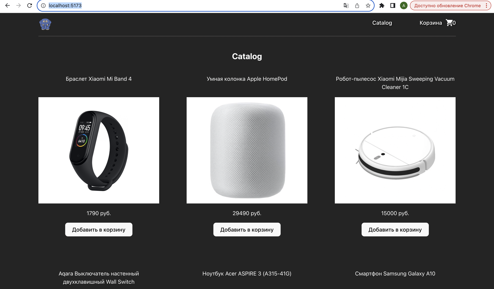
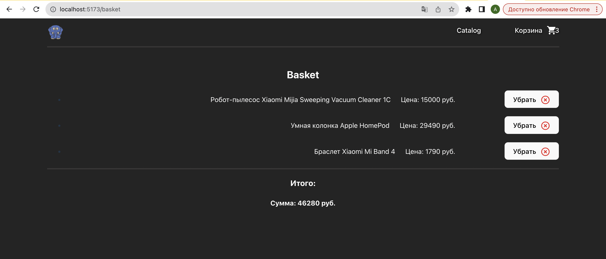

# Проект [AppEvent_TZ](https://github.com/AlexFromNorth/vk) | Frontend / React

### 📜 Описание:
Сайт с товарами и корзиной на `React.js`. Созданно с применением `Vite` и имеет переиспользуемые компоненты.
В планах  улучшить визуальную часть.

### ⚙️ Функционал:
* Single Page Application на Vite в рамках одной страницы без перезагрузок.

* Добавление товаров в корзину и удаления из нее


### 🥞 Стек:

`HTML5` `SCSS` `React` `Material UI` `Vite` `TypeScript` `Axios` `Redux`

### 💽 Установка и запуск:

1. Склонировать репозиторий в текущую папку:

```git clone https://github.com/AlexFromNorth/AppEvent_TZ.git ```

2. Установить зависимости:

```yarn install```

3. Запустить проект в режиме разработки:

```yarn start или yarn run dev```


<br />
<br />

<br />
<br />

<br />
<br />

